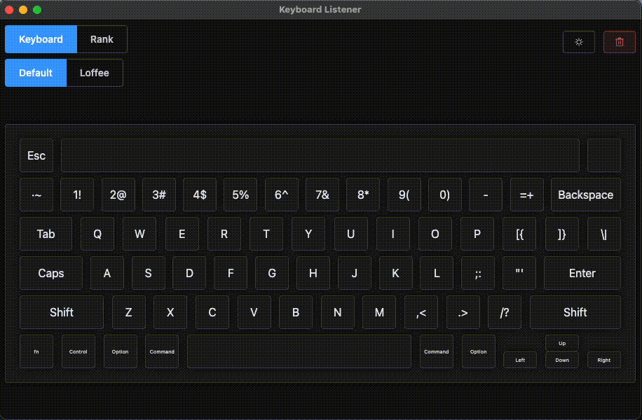
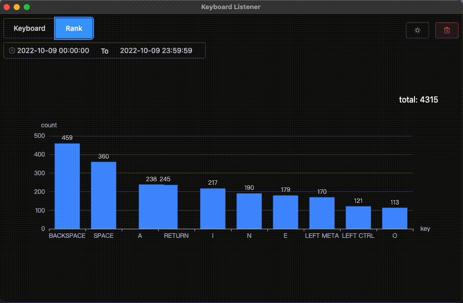

# Electron-Keyboard-Listener

监听全局键盘事件，并且根据时间统计按键按下次数排名。

## Background

因为想统计下自己每天敲了多少次键盘，开发了这个桌面小工具。

支持按键实时提示，根据时间段统计按键的排名。（仅支持 Windows，MacOS）

项目截图：





使用时需要指定系统环境变量`HOME`，该工具会在`HOME`对应文件夹下创建`keyboard-listener.db`文件存储数据。

## Install

使用 yarn 下载依赖

```bash
yarn
```

## Usage

打包项目

```bash
yarn make
```

## Related Efforts

+ [node-global-key-listener](https://github.com/LaunchMenu/node-global-key-listener) - A package to listen to global key events

[MIT © Aimer Fan.](./LICENSE)